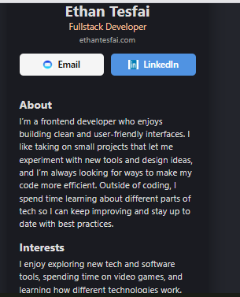

**🚀 Features**

Displays personal info (name, role, and contact details).
Interactive About, Interests, and Contact sections.
Clickable links to external platforms (GitHub, LinkedIn, email, etc.).
Responsive design for both desktop and mobile views.

**🛠 Tech Stack**

Frontend: HTML, CSS, JavaScript

Framework: React (with modular components)

Build Tool: Vite

**📂 Project Structure**

digital-business-card/

│── components/       # React components

│── images/           # Icons and images

│── App.js            # Main app component

│── index.html        # Root HTML

│── index.js          # Entry point

│── style.css         # Styling

│── package.json      # Dependencies

│── vite.config.js    # Build config

│── README.md         # Documentation

**⚙️ Setup & Installation**

Clone the repo:

git clone https://github.com/Tezfai/digital-business-card.git

cd digital-business-card

_Install dependencies:
_
npm install

Run the project locally:

npm run dev

**📸 Demo**

**🎯 Purpose**

This project was built to practice React component-based design and create a practical portfolio piece that demonstrates modern front-end development skills.
